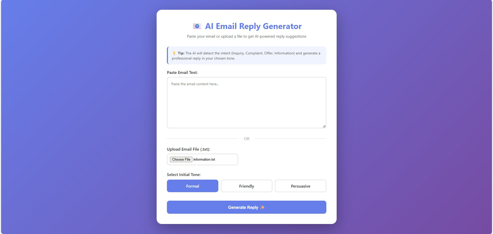
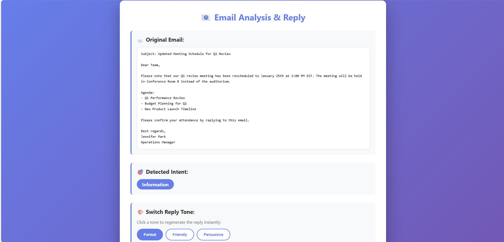
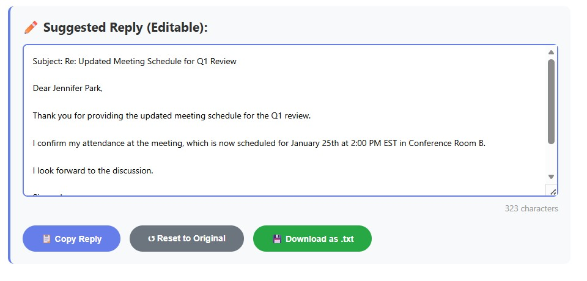

<h1 align="center">AI Email Reply Generator</h1>

---

## Table of Contents
- Overview  
- Features  
- Tech Stack  
- How the System Works  
- Prompt Design Approach  
- Challenges and Edge Cases  
- How to Run the Project  
- Sample Emails  
- Deployment Notes  

---

## Overview
AI Email Reply Generator is a minimal full-stack web application built as part of an internship task. The app allows a user to paste an incoming email and instantly receive an AI-powered analysis and response. The system detects the email intent, generates a professional reply, and suggests different tones while allowing the user to edit the final response.

The backend is implemented using Flask, following standard Flask project conventions with `templates` and `static` folders. The frontend is lightweight, focusing on clean UX and responsive interaction.

---

## Features
The application detects email intent as Inquiry, Complaint, Offer, or Information. It generates professional AI-based replies and provides tone variations such as formal, friendly, or persuasive. The generated reply is editable, allowing users to fine-tune the response before use.

---

## Tech Stack
The backend is built with Python and Flask. The frontend uses HTML, CSS, and JavaScript. An LLM provider is used for intent classification and reply generation. Static and template folders are used to serve frontend assets.

---

## How the System Works
The user pastes an email into the web interface. The text is sent to the Flask backend, which classifies the intent and constructs a prompt for the AI model. The AI generates a professional reply based on the intent and tone. The response is then returned to the frontend and displayed in an editable text area for user adjustments.

---

## Prompt Design Approach
The prompt is designed to first classify the email intent and then generate a response aligned with the intent and selected tone. Constraints ensure professional language, concise output, and tone consistency. All outputs are generated dynamically by the AI, with no hard-coded responses.

---

## Challenges and Edge Cases
Challenges included handling emails with mixed intents, maintaining tone consistency across outputs, and ensuring the AI avoids irrelevant or generic replies. Careful prompt design and testing with sample emails helped address these issues.

---

## How to Run the Project
Navigate to the backend directory and run the Flask application:

```bash
cd backend
python main.py
```

Once the server is running, open your browser and visit:

```bash
http://localhost:5000
```

---

## Sample Emails

The project includes sample emails for testing intent detection and response generation, covering complaints, inquiries, offers, and informational messages.

---

## Demo
The following images show the workflow of the AI Email Reply Generator:

**1. Main Page – User Input**  
The user can either paste an email or browse to upload a sample email.  



**2. Original Email and Tone Selection**  
After submitting, the original email is displayed and the user can choose the tone for the AI-generated reply.  



**3. AI-Generated Reply – Editable**  
The AI-generated reply is shown in an editable text area, allowing the user to fine-tune the response before sending.  



---

## Deployment Notes

The application can be deployed on any platform supporting Python and Flask. Static assets are served through Flask’s static folder, making deployment simple and scalable.
